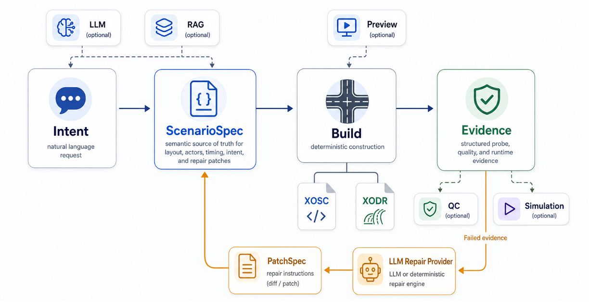

# ScenarioCraft

**Structured autonomous-driving scenario generation, validation, and repair.**

ScenarioCraft is a local-first research prototype that turns a scenario request
into a typed scenario contract, deterministic OpenSCENARIO/OpenDRIVE artifacts,
semantic previews, check evidence, optional runtime evidence, and constrained
repair patches.

It is designed around a simple rule: LLMs may propose structured intent or
structured patches, but deterministic code builds, checks, previews, executes,
and reports the scenario.



## What It Does

```text
natural language
-> ScenarioIntent
-> scenario family template
-> ScenarioSpec
-> XOSC + XODR
-> Preview 2D + checks + optional QC/runtime evidence
-> PatchSpec repair loop when needed
```

ScenarioCraft keeps three loops separate:

- **Candidate Generation Loop**: candidate parameters/spec -> deterministic checks -> accepted `ScenarioSpec`.
- **Scenario Revision Loop**: existing `ScenarioSpec` + user edit request -> new candidate generation.
- **PatchSpec Repair Loop**: failed accepted evidence -> constrained `PatchSpec` -> rebuild/recheck.

ScenarioCraft currently focuses on five executable interaction families:

| Family | Description |
| --- | --- |
| `pedestrian_occlusion` | Ego approaches an occluder and a pedestrian emerges from behind it. |
| `lead_vehicle_braking` | Ego follows a lead vehicle that brakes sharply. |
| `cut_in` | A vehicle from an adjacent lane cuts into ego's lane. |
| `crossing_vehicle` | A vehicle crosses ego's path at an intersection. |
| `oncoming_turn_across_path` | An oncoming vehicle turns across ego's path. |

ScenarioCraft is not a production validation suite. It is an inspectable
prototype for structured scenario generation workflows.

## Quickstart

### 1. Clone

```bash
git clone https://github.com/<your-org>/ScenarioCraft-Agent.git
cd ScenarioCraft-Agent
```

### 2. Create the Environment

Python 3.11 or 3.12 is recommended.

```bash
python3.11 -m venv .venv
.venv/bin/python -m pip install -U pip uv
UV_CACHE_DIR=.uv-cache .venv/bin/uv sync --extra dev --extra web --extra openai --extra qc
```

### 3. Install Optional Local Tools

The setup helper installs or locates optional tools used by the full workflow:

```bash
.venv/bin/python -m scenariocraft.tooling.setup_tools
```

It prints the environment variables to export for:

- `ESMINI_BIN`
- `ASAM_QC_OPENSCENARIOXML_BIN`

The basic mock workflow works without these tools, but esmini and ASAM QC are
recommended for full local reproduction.

### 4. Start the Web UI

```bash
.venv/bin/just web
```

Then open:

```text
http://localhost:8501
```

The Web workspace lets you generate a scenario, inspect the selected family,
view Preview 2D, run controlled cases, and inspect runtime media when esmini is
configured.

### 5. Run the CLI

Generate the default scenario:

```bash
.venv/bin/python -m scenariocraft.main \
  --input examples/pedestrian_occlusion.txt \
  --out outputs/demo \
  --provider mock
```

Require esmini:

```bash
.venv/bin/python -m scenariocraft.main \
  --input examples/pedestrian_occlusion.txt \
  --out outputs/demo_esmini \
  --provider mock \
  --require-esmini
```

Generated artifacts are written under `outputs/`, which is gitignored.

## Local LLM Provider

ScenarioCraft can use any OpenAI-compatible endpoint for natural-language to
`ScenarioIntent` routing. Ollama is the simplest local option:

```bash
ollama pull qwen2.5:7b
ollama serve
```

In the shell that starts ScenarioCraft:

```bash
export SCENARIOCRAFT_LOCAL_LLM_BASE_URL=http://localhost:11434/v1
export SCENARIOCRAFT_LOCAL_LLM_API_KEY=local
export SCENARIOCRAFT_LOCAL_LLM_MODEL=qwen2.5:7b
.venv/bin/just web
```

The model proposes structured `ScenarioIntent` JSON only. Registered scenario
families, parameter domains, deterministic builders, and checks remain
authoritative.

## Optional Tool Details

See:

- [Tool setup](docs/tool_setup.md)
- [Local LLM setup](docs/local_llm.md)

## Core Concepts

- `ScenarioIntent`: compact structured intent, suitable for LLM/provider output.
- `ScenarioTemplate`: deterministic scenario-family generator.
- `ScenarioSpec`: typed scenario contract and semantic source of truth.
- `CheckResult`: structured evidence from deterministic checks.
- `PatchSpec`: constrained repair operations applied to `ScenarioSpec`, not raw XML.

See [Architecture](docs/architecture.md) for the longer overview.

## Project Layout

```text
scenariocraft/
  core/             scenario contracts, templates, checks, repair, build, metrics
  web/              Streamlit UI

assets/roads/       road assets used by generated scenarios
examples/           small CLI request examples
tests/              unit and workflow tests
outputs/            generated artifacts, gitignored
```

For a slightly longer public structure overview, see
[Repository layout](docs/repository_layout.md).

## Development

Run tests:

```bash
.venv/bin/just test
```

Run the CLI smoke test:

```bash
.venv/bin/just smoke
```

See [Contributing](CONTRIBUTING.md) for the contribution workflow.

ScenarioCraft is licensed under the [Apache License 2.0](LICENSE).

## References

- [esmini](https://github.com/esmini/esmini)
- [ASAM QC Framework](https://github.com/asam-ev/qc-framework)
- [pyoscx/scenariogeneration](https://github.com/pyoscx/scenariogeneration)
- [ASAM OpenSCENARIO](https://www.asam.net/standards/detail/openscenario/)
- [ASAM OpenDRIVE](https://www.asam.net/standards/detail/opendrive/)
